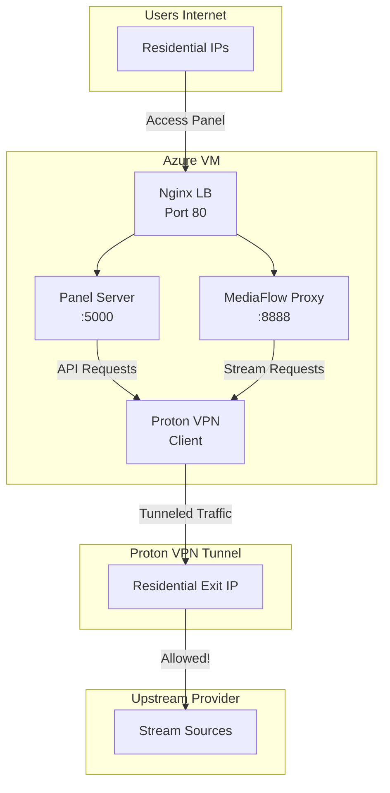

# Proton VPN Setup Plan for Bypassing Upstream Blocks

## Problem Statement

Your Azure VM IP is being blocked by the upstream provider because:
- Azure datacenter IPs are blacklisted
- Geographic restrictions are enforced

**Solution**: Route upstream traffic through Proton VPN's residential IPs to appear as a home user.

## Current Architecture

```
Internet → Azure VM [Public IP: xxx.xxx.xxx.xxx]
                    ↓
           Nginx (Port 80)
                    ↓
           Panel Server + MediaFlow Proxy
                    ↓
           Upstream Provider ← BLOCKED (Azure IP detected)
```

## Proposed Architecture with Proton VPN

```
Internet → Azure VM [Public IP: xxx.xxx.xxx.xxx]
                    ↓
           Nginx (Port 80) - Still accepts incoming connections
                    ↓
           Panel Server + MediaFlow Proxy
                    ↓
           [Outbound Traffic Routes Here]
                    ↓
           Proton VPN Tunnel → Residential IP → Upstream Provider ✓ ALLOWED
```

## Proton VPN Free Tier Capabilities

| Feature | Free Tier |
|---------|-----------|
| Countries | 3 (US, Netherlands, Japan) |
| Speed | Medium |
| Simultaneous connections | 1 |
| Residential IPs | Yes |
| No logs policy | Yes |
| Kill switch | Built-in |

## Implementation Plan

### Phase 1: Install Proton VPN on Azure VM

#### Option A: Using Proton VPN CLI (Recommended)

```bash
# Download and install Proton VPN CLI
wget https://repo.protonvpn.net/debian/dists/stable/main/binary-all/protonvpn-cli-linux_all.deb
sudo apt install ./protonvpn-cli-linux_all.deb

# Initialize and login
sudo protonvpn init
sudo protonvpn login

# Connect to a free server (e.g., Netherlands)
sudo protonvpn connect --cc NL
```

#### Option B: Using OpenVPN (Alternative)

```bash
# Install OpenVPN
sudo apt install openvpn

# Download Proton VPN OpenVPN configuration files
# Get free configs from: https://protonvpn.com/free-vpn

# Connect
sudo openvpn --config nl-free.opvn
```

### Phase 2: Configure Routing (Split Tunnel)

We need to route only upstream provider traffic through VPN, not all traffic:

```bash
# Create routing table for upstream traffic
# Replace with actual upstream provider IP ranges
UPSTREAM_IPS="203.0.113.0/24 198.51.100.0/24"

# Create script to add routes
cat > /usr/local/bin/vpn-routes.sh << 'EOF'
#!/bin/bash
UPSTREAM_IPS="203.0.113.0/24 198.51.100.0/24"  # Update these
VPN_INTERFACE="tun0"  # or your VPN interface

for ip in $UPSTREAM_IPS; do
    ip route add $ip via $VPN_GATEWAY dev $VPN_INTERFACE
done
EOF

chmod +x /usr/local/bin/vpn-routes.sh
```

### Phase 3: Set Up Kill Switch

Prevent traffic leaks if VPN disconnects:

```bash
# Create firewall rules to block non-VPN traffic
cat > /etc/iptables/rules.v4 << 'EOF'
# Allow established connections
-A INPUT -m state --state ESTABLISHED,RELATED -j ACCEPT

# Allow loopback
-A INPUT -i lo -j ACCEPT

# Allow SSH
-A INPUT -p tcp --dport 22 -j ACCEPT

# Allow Nginx
-A INPUT -p tcp --dport 80 -j ACCEPT

# Drop all other INPUT
-A INPUT -j DROP

# Allow only VPN interface for outgoing traffic
-A OUTPUT -o tun+ -j ACCEPT
-A OUTPUT -o eth0 -p udp --dport 1194 -j ACCEPT  # VPN port
-A OUTPUT -o eth0 -j DROP
EOF

iptables-restore < /etc/iptables/rules.v4
```

### Phase 4: Configure Docker for VPN

Ensure Docker containers can use the VPN:

```yaml
# Add to docker-compose.yml - not needed if using host networking
# Docker will use the host's routing table
```

### Phase 5: Start Services in Order

```bash
# 1. Connect VPN first
sudo protonvpn connect --cc NL

# 2. Wait for VPN to establish
sleep 5

# 3. Verify IP change
curl ifconfig.co

# 4. Start Docker services
docker-compose up -d

# 5. Verify everything works
curl -u admin:admin123 http://localhost/
```

## Testing Checklist

- [ ] VPN connects successfully to Proton VPN
- [ ] Public IP shows as residential (not Azure)
- [ ] Nginx still accepts incoming connections
- [ ] Upstream provider accepts connections
- [ ] Streams load correctly
- [ ] Kill switch blocks traffic when VPN disconnects

## Architecture Diagram



## Commands Reference

### Daily Operations

```bash
# Connect VPN
sudo protonvpn connect --cc NL

# Connect to specific server
sudo protonvpn connect --cc US --server US-NL#1

# Check status
protonvpn status

# Disconnect
sudo protonvpn disconnect

# View logs
sudo journalctl -u protonvpn
```

### Troubleshooting

```bash
# Check current public IP
curl ifconfig.co

# Check VPN interface
ip addr show tun0

# Check routing table
ip route show

# Test upstream connectivity
curl -v https://upstream-provider.com/test
```

## Important Considerations

1. **Free Tier Limitations**: Only 3 countries available. Choose the one closest to your target upstream provider for best performance.

2. **Speed**: Free tier has medium speed. Test if sufficient for your streaming needs.

3. **Single Connection**: Only one VPN connection at a time on free tier.

4. **Azure Firewall**: Ensure outbound UDP 1194 is allowed in Azure Network Security Group.

5. **Static vs Dynamic IPs**: Proton VPN free uses shared IPs, which is good for privacy but may occasionally be rate-limited.

## Next Steps

1. Confirm which country's servers work best with your upstream provider
2. Create Proton VPN account if not already done
3. Prepare Azure VM for VPN installation
4. Test with small traffic before full deployment
